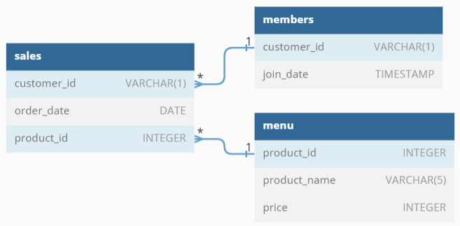
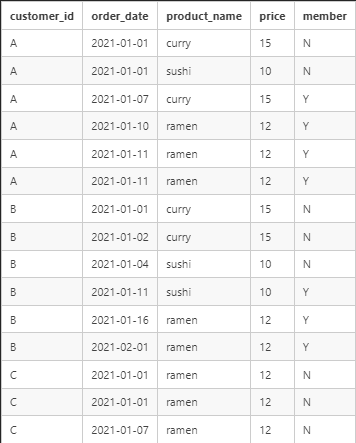

# Introduction

Danny seriously loves Japanese food so in the beginning of 2021, he decides to embark upon a risky venture and opens up a cute little restaurant that sells his 3 favourite foods: sushi, curry and ramen.

# Problem Statement

Danny wants to use the data to answer a few simple questions about his customers. Having a deeper connection with his customers will help him deliver a better and more personalised experience for his loyal customers.

# Data

Danny has shared with you 3 key datasets for this case study:
* **SALES:** captures all [customer_id]() level purchases with an corresponding [order_date]() and [product_id]() information for when and what menu items were ordered.
* **MENU:** maps the [product_id]() to the actual [product_name]() and price of each menu item.
* **MEMBERS:** captures the [join_date]() when a [customer_id]() joined the beta version of the Danny’s Diner loyalty program.

# Entity Relationship Diagram

<p align="center">
  
</p>


# Case Study Solutions

1. **What is the total amount each customer spent at the restaurant?**
* Left join the data from the menu table to the sales table using the product_id as the link between the two tables.
* Group the orders made in the sales table by the customer_id.
* Sum the price for each order by customer_id to obtain the total_spent by customer.
```SQL
SELECT s.customer_id, 
	SUM(m.price) AS total_spent
FROM dannys_diner.sales s
	LEFT JOIN dannys_diner.menu m 
	ON s.product_id = m.product_id
GROUP BY s.customer_id
ORDER BY s.customer_id;
```
| customer_id | total_spent |
| ----------- | ----------- |
| A           | 76          |
| B           | 74          |
| C           | 36          |
---


2. **How many days has each customer visited the restaurant?**
* Group the orders made in the sales table by the customer_id.
* Use the distinct count function on order_date to count the number of unique dates per customer.

```SQL
SELECT customer_id, 
       COUNT(DISTINCT order_date)
FROM dannys_diner.sales
GROUP BY customer_id
ORDER BY customer_id;
```
| customer_id | count |
| ----------- | ----- |
| A           | 4     |
| B           | 6     |
| C           | 2     |
---


3. **What was the first item from the menu purchased by each customer?**
* Left join the data from the menu table to the sales table using the product_id as the link between the two tables.
* Sort the table by the order_date and then by customer_id to find the earliest purchases by customer.
* Note one, customers A and C ordered more than one item during their first purchase.
* Note two, the query below will return all the orders made sorted by date and customer. The table below is a subset of the full table.
```SQL
SELECT s.customer_id, 
       s.order_date, 
       m.product_name
FROM dannys_diner.sales s
	LEFT JOIN dannys_diner.menu m 
	ON s.product_id = m.product_id
ORDER BY s.order_date, 
	 s.customer_id;
```
| customer_id | order_date               | product_name |
| ----------- | ------------------------ | ------------ |
| A           | 2021-01-01T00:00:00.000Z | sushi        |
| A           | 2021-01-01T00:00:00.000Z | curry        |
| B           | 2021-01-01T00:00:00.000Z | curry        |
| C           | 2021-01-01T00:00:00.000Z | ramen        |
| C           | 2021-01-01T00:00:00.000Z | ramen        |
---


4. **What is the most purchased item on the menu and how many times was it purchased by all customers?**
* Left join the data from the menu table to the sales table using the product_id as the link between the two tables.
* Count the number of times each product_id appears in the sales table 
* Sort the joined table by the purchase_count of each product_id from greatest to least
* Limit the output to the top product_name purchased
```SQL
SELECT s.product_id, 
       m.product_name, 
       COUNT(s.product_id) AS purchase_count
FROM dannys_diner.sales s
	LEFT JOIN dannys_diner.menu m 
	ON s.product_id = m.product_id
GROUP BY s.product_id, m.product_name
ORDER BY purchase_count DESC
LIMIT 1;
```
| product_id | product_name | purchase_count |
| ---------- | ------------ | -------------- |
| 3          | ramen        | 8              |
---


5. **Which item was the most popular for each customer?**
* In the subquery, left join the data from the menu table to the sales table using the product_id as the link between the two tables.
* Count the number of rows per customer_id and then per product_name. This provides the number of times each customer ordered each item.
* Use the RANK OVER statement to rank the order counts by customer_id. 
* The outer query returns the customer_id and products_names that have a rank = 1 (i.e., most popular item[s]).
* Ramen was the most popular item for customers A and C. Customer B ordered each item the same amount.
```SQl
SELECT
    tab.customer_id, tab.product_name, tab.cnt
FROM 
	(SELECT s.customer_id, 
		m.product_name, 
        	COUNT(*) AS cnt,
        	RANK() OVER (PARTITION BY s.customer_id ORDER BY COUNT(*) DESC) AS rnk
	FROM dannys_diner.sales s
		LEFT JOIN dannys_diner.menu m 
		ON s.product_id = m.product_id
	 GROUP BY s.customer_id, m.product_name
	 ) AS tab
WHERE rnk = 1;
```
| customer_id | product_name | cnt |
| ----------- | ------------ | --- |
| A           | ramen        | 3   |
| B           | ramen        | 2   |
| B           | curry        | 2   |
| B           | sushi        | 2   |
| C           | ramen        | 3   |
---


6. **Which item was purchased first by the customer after they became a member?**
* In the subquery, join all tables together using the product_id and customer_id as the link between tables.
* Use the WHERE statement to filter out orders made before a customer became a member
* Per customer, use the RANK OVER statement to rank the orders by the date they were made.
* The outer query returns the customer_id and products_names that have a rank = 1 (i.e., first order made by each customer after becoming a member).
* Customer A ordered ramen, and customer B ordered sushi. 

```SQL
SELECT
    tab.customer_id, tab.order_date, tab.product_name, tab.join_date
FROM (
	SELECT s.customer_id, s.order_date, m.product_name, mbr.join_date,
	RANK() OVER (PARTITION BY s.customer_id ORDER BY s.order_date ASC) AS rnk
	FROM dannys_diner.sales s
	JOIN dannys_diner.menu m
  		ON s.product_id = m.product_id
	JOIN dannys_diner.members mbr
  		ON s.customer_id = mbr.customer_id
	WHERE order_date > join_date 
    GROUP BY s.customer_id, s.order_date, m.product_name, mbr.join_date
	ORDER BY s.order_date, s.customer_id
	) AS tab
WHERE rnk = 1;
```


| customer_id | order_date               | product_name | join_date                |
| ----------- | ------------------------ | ------------ | ------------------------ |
| A           | 2021-01-10T00:00:00.000Z | ramen        | 2021-01-07T00:00:00.000Z |
| B           | 2021-01-11T00:00:00.000Z | sushi        | 2021-01-09T00:00:00.000Z |
---


7. **Which item was purchased just before the customer became a member?**
* This is the same code that was used to answer Question 6. The only changes made are 
* 	1) The WHERE statement is used to filter out orders made after a customer became a member 
* 	2) that in the RANK() function, the ordering is reversed to DESC so that the order_date closest to the join_date has a rank of 1. 
```SQL
SELECT
    tab.customer_id, tab.order_date, tab.product_name, tab.join_date
FROM (
	SELECT s.customer_id, s.order_date, m.product_name, mbr.join_date,
	RANK() OVER (PARTITION BY s.customer_id ORDER BY s.order_date DESC) AS rnk
	FROM dannys_diner.sales s
		JOIN dannys_diner.menu m ON s.product_id = m.product_id
		JOIN dannys_diner.members mbr ON s.customer_id = mbr.customer_id
	WHERE order_date < join_date 
    GROUP BY s.customer_id, s.order_date, m.product_name, mbr.join_date
	ORDER BY s.order_date, s.customer_id
	) AS tab
WHERE rnk = 1;
```
| customer_id | order_date               | product_name | join_date                |
| ----------- | ------------------------ | ------------ | ------------------------ |
| A           | 2021-01-01T00:00:00.000Z | curry        | 2021-01-07T00:00:00.000Z |
| A           | 2021-01-01T00:00:00.000Z | sushi        | 2021-01-07T00:00:00.000Z |
| B           | 2021-01-04T00:00:00.000Z | sushi        | 2021-01-09T00:00:00.000Z |
---


8. **What is the total items and amount spent for each member before they became a member?**

* Join all tables together using the product_id and customer_id as the link between tables.
* Use WHERE statement to filter out orders made before a customer became a member
* Use GROUP BY statement to perform calculations by customer
* COUNT(*) function determines the number of orders made by customer
* SUM(m.price) calculates the total spent by customer before membership
```SQL
SELECT s.customer_id, COUNT(*) AS total_items, SUM(m.price) AS amnt_spent
FROM dannys_diner.sales s
	JOIN dannys_diner.menu m ON s.product_id = m.product_id
	JOIN dannys_diner.members mbr ON s.customer_id = mbr.customer_id
WHERE s.order_date < mbr.join_date 
GROUP BY s.customer_id
ORDER BY s.customer_id;
```
| customer_id | total_items | amnt_spent |
| ----------- | ----------- | ---------- |
| A           | 2           | 25         |
| B           | 3           | 40         |
---


9. **If each $1 spent equates to 10 points and sushi has a 2x points multiplier - how many points would each customer have?**
* Use a subquery to create a table that contains the number of points per item ordered
* This is done by using the CASE expression as an IF/ELSE statement to find the sushi vs other orders.
* Text in a column can be found using '=' in the WHEN statement
* The appropriate points per order are then applied using the price_id
* An outer query is used to summarize the total number of points per customer with the SUM() function and GROUP BY statement.  
```SQL
SELECT tbl.customer_id, SUM(points) AS total_pts
FROM (
	SELECT s.customer_id, 
    		CASE WHEN m.product_name = 'sushi' 
    			THEN 2*10*m.price
    			ELSE 10*m.price 
     		END AS points
	FROM dannys_diner.sales s
		JOIN dannys_diner.menu m ON s.product_id = m.product_id
) AS tbl
GROUP BY tbl.customer_id
ORDER BY tbl.customer_id;
```
| customer_id | sum |
| ----------- | --- |
| A           | 860 |
| B           | 940 |
| C           | 360 |
---


10. **In the first week after a customer joins the program (including their join date) they earn 2x points on all items, not just sushi - how many points do customer A and B have at the end of January?**

* The same approach taken in #9 is used here with the following additions:
* i.  In the subquery, an additional WHEN statement is used to find the orders that occur within the first week of joining the program.
* ii. A WHERE statement in the tbl is used to filter out orders that occur before February.
```SQL
SELECT tbl.customer_id, SUM(points) AS total_pts
FROM (
	SELECT s.customer_id, s.order_date,
    		CASE WHEN m.product_name = 'sushi' THEN 2*10*m.price
 	     	     WHEN  s.order_date BETWEEN  mbr.join_date AND mbr.join_date + interval '7' day THEN 2*10*m.price
             	     ELSE 10*m.price  
     		END AS points
	FROM dannys_diner.sales s
		JOIN dannys_diner.menu m ON s.product_id = m.product_id
    		JOIN dannys_diner.members mbr ON s.customer_id = mbr.customer_id
	ORDER BY s.customer_id, s.order_date
) AS tbl
WHERE tbl.order_date < '2021-02-01'
GROUP BY tbl.customer_id
ORDER BY tbl.customer_id;
```
| customer_id | total_pts |
| ----------- | --------- |
| A           | 1370      |
| B           | 940       |
---


11.  **Danny would like to recreate the white table shown below.**
<p align="center">
  
</p>

```SQL
SELECT s.customer_id, s.order_date, m.product_name, m.price,
	   CASE WHEN s.order_date < mbr.join_date THEN 'N'
    		WHEN s.order_date >= mbr.join_date THEN 'Y' 
            WHEN mbr.join_date IS NULL THEN 'N'
       END AS member
FROM dannys_diner.sales s
	LEFT JOIN dannys_diner.menu m ON s.product_id = m.product_id
	LEFT JOIN dannys_diner.members mbr ON s.customer_id = mbr.customer_id
ORDER BY s.customer_id, s.order_date;
```
| customer_id | order_date               | product_name | price | member |
| ----------- | ------------------------ | ------------ | ----- | ------ |
| A           | 2021-01-01T00:00:00.000Z | sushi        | 10    | N      |
| A           | 2021-01-01T00:00:00.000Z | curry        | 15    | N      |
| A           | 2021-01-07T00:00:00.000Z | curry        | 15    | Y      |
| A           | 2021-01-10T00:00:00.000Z | ramen        | 12    | Y      |
| A           | 2021-01-11T00:00:00.000Z | ramen        | 12    | Y      |
| A           | 2021-01-11T00:00:00.000Z | ramen        | 12    | Y      |
| B           | 2021-01-01T00:00:00.000Z | curry        | 15    | N      |
| B           | 2021-01-02T00:00:00.000Z | curry        | 15    | N      |
| B           | 2021-01-04T00:00:00.000Z | sushi        | 10    | N      |
| B           | 2021-01-11T00:00:00.000Z | sushi        | 10    | Y      |
| B           | 2021-01-16T00:00:00.000Z | ramen        | 12    | Y      |
| B           | 2021-02-01T00:00:00.000Z | ramen        | 12    | Y      |
| C           | 2021-01-01T00:00:00.000Z | ramen        | 12    | N      |
| C           | 2021-01-01T00:00:00.000Z | ramen        | 12    | N      |
| C           | 2021-01-07T00:00:00.000Z | ramen        | 12    | N      |
---


12. **Danny also requires further information about the ranking of customer products, but he purposely does not need the ranking for non-member purchases so he expects null ranking values for the records when customers are not yet part of the loyalty program.**
* The same approach taken in #11 is used here with the following additions:
* i. An additional CASE WHEN statement is used to create the ranking column
* ii. In this second CASE WHEN, orders before the joined date are durned into NULL
* iii. Orders on or after the join date are grouped by customer and a third CASE WHEN is used to identify with orders on/after the join date
* iv. Then ranked based on their order date

```SQL
SELECT s.customer_id, s.order_date, m.product_name, m.price,
	CASE WHEN s.order_date < mbr.join_date THEN 'N'
    		WHEN s.order_date >= mbr.join_date THEN 'Y' 
            	WHEN mbr.join_date IS NULL THEN 'N'
	END AS member,
       
        CASE WHEN s.order_date < mbr.join_date THEN NULL
       		ELSE RANK() OVER (PARTITION BY s.customer_id, (CASE WHEN s.order_date >= mbr.join_date THEN 1 ELSE 2 END)
                                  ORDER BY s.order_date)
        END AS rnk 
FROM dannys_diner.sales s
	LEFT JOIN dannys_diner.menu m ON s.product_id = m.product_id
	LEFT JOIN dannys_diner.members mbr ON s.customer_id = mbr.customer_id
WHERE s.customer_id IN ('A','B')
ORDER BY s.customer_id, s.order_date;
```
| customer_id | order_date               | product_name | price | member | rnk |
| ----------- | ------------------------ | ------------ | ----- | ------ | --- |
| A           | 2021-01-01T00:00:00.000Z | curry        | 15    | N      |     |
| A           | 2021-01-01T00:00:00.000Z | sushi        | 10    | N      |     |
| A           | 2021-01-07T00:00:00.000Z | curry        | 15    | Y      | 1   |
| A           | 2021-01-10T00:00:00.000Z | ramen        | 12    | Y      | 2   |
| A           | 2021-01-11T00:00:00.000Z | ramen        | 12    | Y      | 3   |
| A           | 2021-01-11T00:00:00.000Z | ramen        | 12    | Y      | 3   |
| B           | 2021-01-01T00:00:00.000Z | curry        | 15    | N      |     |
| B           | 2021-01-02T00:00:00.000Z | curry        | 15    | N      |     |
| B           | 2021-01-04T00:00:00.000Z | sushi        | 10    | N      |     |
| B           | 2021-01-11T00:00:00.000Z | sushi        | 10    | Y      | 1   |
| B           | 2021-01-16T00:00:00.000Z | ramen        | 12    | Y      | 2   |
| B           | 2021-02-01T00:00:00.000Z | ramen        | 12    | Y      | 3   |
---

