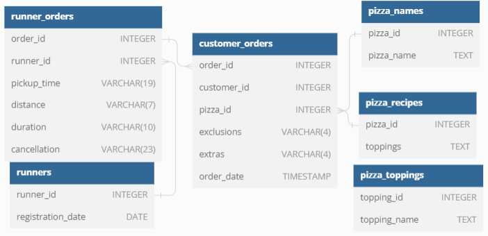

# Introduction
Pizza Runner is a uber-style pizza delivery company. “Runners” deliver fresh pizza from Pizza Runner Headquarters 
(otherwise known as Danny’s house). Danny has also paid freelance developers to build a mobile app to accept orders from customers.

# Problem
Danny would like to clean the data he has collected, and apply some basic calculations so he can better direct his runners and 
optimise Pizza Runner’s operations.

# Data
Danny has shared five datasets for this case study:
*  **RUNNERS:** shows the registration_date for each new runner.
*  **CUSTOMER ORDERS:** each row represents a pizza ordered by a customer. Customer's can order multiple pizzas in a signle order. A [ingredient_id]() is used to determine which ingredients should be removed ([exclusions]()) or should be added ([extras]()).
*  **RUNNER ORDERS:** each order is assigned to a runner for delivery. This table contains delivery information such as the [pickup_time](), and how long ([duration]()) and how far ([distance]()) the runner had to travel to deliver the order.
*   **PIZZA NAMES:** Pizza Runner only has 2 pizzas available the Meat Lovers or Vegetarian.
*   **PIZZA RECIPES:** Each [pizza_id]() has a standard set of toppings which are used as part of the pizza recipe.
*   **PIZZA TOPPING:** This table contains all of the [topping_name]() values with their corresponding [topping_id]() value.

# Entity Relationship Diagram
<p align="center">
  
</p>

# Data Cleaning
## **customer_orders table:** 
* The exclusions and extras columns will need to be cleaned up before using them in your queries.
```SQL
-- Check data types of column
SELECT column_name, data_type
FROM information_schema.columns
WHERE table_schema = 'pizza_runner' AND 
	  table_name = 'customer_orders';
```
| column_name | data_type                   |
| ----------- | --------------------------- |
| order_id    | integer                     |
| customer_id | integer                     |
| pizza_id    | integer                     |
| exclusions  | character varying           |
| extras      | character varying           |
| order_time  | timestamp without time zone |

```SQL
-- Print the unique values per column.
SELECT DISTINCT exclusions, extras
FROM pizza_runner.customer_orders;
```
| exclusions | extras |
| ---------- | ------ |
| 4          | 1, 5   |
| 2, 6       | 1, 4   |
| 4          |        |
| null       | 1      |
|            |        |
| null       | null   |
|            | null   |

```SQL
-- Update the customer.orders table
-- Use the CASE statement to find the rows that equal 'null' or '' and replace with NULL
UPDATE pizza_runner.customer_orders
    SET exclusions = 
    	    CASE WHEN exclusions ='' THEN NULL
                 WHEN exclusions = 'null' THEN NULL
                 ELSE exclusions
            END;
UPDATE pizza_runner.customer_orders
    SET extras = 
    		CASE WHEN extras = '' THEN NULL
                 WHEN extras = 'null' THEN NULL
                 ELSE extras
            END;
```
| order_id | customer_id | pizza_id | exclusions | extras | order_time               |
| -------- | ----------- | -------- | ---------- | ------ | ------------------------ |
| 1        | 101         | 1        |            |        | 2020-01-01T18:05:02.000Z |
| 2        | 101         | 1        |            |        | 2020-01-01T19:00:52.000Z |
| 3        | 102         | 1        |            |        | 2020-01-02T23:51:23.000Z |
| 3        | 102         | 2        |            |        | 2020-01-02T23:51:23.000Z |
| 4        | 103         | 1        | 4          |        | 2020-01-04T13:23:46.000Z |
| 4        | 103         | 1        | 4          |        | 2020-01-04T13:23:46.000Z |
| 4        | 103         | 2        | 4          |        | 2020-01-04T13:23:46.000Z |
| 5        | 104         | 1        |            | 1      | 2020-01-08T21:00:29.000Z |
| 6        | 101         | 2        |            |        | 2020-01-08T21:03:13.000Z |
| 7        | 105         | 2        |            | 1      | 2020-01-08T21:20:29.000Z |
| 8        | 102         | 1        |            |        | 2020-01-09T23:54:33.000Z |
| 9        | 103         | 1        | 4          | 1, 5   | 2020-01-10T11:22:59.000Z |
| 10       | 104         | 1        |            |        | 2020-01-11T18:34:49.000Z |
| 10       | 104         | 1        | 2, 6       | 1, 4   | 2020-01-11T18:34:49.000Z |
---


## **runner_orders:**
There are some known data issues with this table so be careful when using this in your queries - make sure to check the data types for each column in the schema SQL.
```SQL
-- Check data types of column
SELECT column_name, data_type
FROM information_schema.columns
WHERE table_schema = 'pizza_runner' AND 
table_name = 'runner_orders';
```
| column_name  | data_type         |
| ------------ | ----------------- |
| order_id     | integer           |
| runner_id    | integer           |
| pickup_time  | character varying |
| distance     | character varying |
| duration     | character varying |
| cancellation | character varying |

```SQL
-- Print the table to check the values
SELECT *
FROM pizza_runner.runner_orders;
```
| order_id | runner_id | pickup_time         | distance | duration   | cancellation            |
| -------- | --------- | ------------------- | -------- | ---------- | ----------------------- |
| 1        | 1         | 2020-01-01 18:15:34 | 20km     | 32 minutes |                         |
| 2        | 1         | 2020-01-01 19:10:54 | 20km     | 27 minutes |                         |
| 3        | 1         | 2020-01-03 00:12:37 | 13.4km   | 20 mins    |                         |
| 4        | 2         | 2020-01-04 13:53:03 | 23.4     | 40         |                         |
| 5        | 3         | 2020-01-08 21:10:57 | 10       | 15         |                         |
| 6        | 3         | null                | null     | null       | Restaurant Cancellation |
| 7        | 2         | 2020-01-08 21:30:45 | 25km     | 25mins     | null                    |
| 8        | 2         | 2020-01-10 00:15:02 | 23.4 km  | 15 minute  | null                    |
| 9        | 2         | null                | null     | null       | Customer Cancellation   |
| 10       | 1         | 2020-01-11 18:50:20 | 10km     | 10minutes  | null                    |

* **cancellation:** replace '' and 'null' with NULL and change to type string
* **duration:** replace 'null' with NULL, remove text, and change to type integer
* **distance:** replace 'null' with NULL, remove text, and change to type double
* **pickup_time:** replace 'null' with NULL and  change to type DATETIME 


```SQL
-- replace nulls and '' replace with NULL
UPDATE pizza_runner.runner_orders
    SET cancellation = 
    	    CASE WHEN cancellation ='' THEN NULL
                 WHEN cancellation = 'null' THEN NULL
                 ELSE cancellation
            END,
        duration    = CASE WHEN duration    = 'null' THEN NULL ELSE duration END,
        distance    = CASE WHEN distance    = 'null' THEN NULL ELSE distance END,
        pickup_time = CASE WHEN pickup_time = 'null' THEN NULL ELSE pickup_time END;


-- remove the text from the duration & distance variables.
-- remove extra texrt 'cancellation' for cancellation column, redundant
UPDATE pizza_runner.runner_orders
SET distance     = REGEXP_REPLACE(distance,'[[:alpha:]]','','g'),
    duration     = REGEXP_REPLACE(duration,'[[:alpha:]]','','g'),
    cancellation = REGEXP_REPLACE(cancellation,' Cancellation','','g');

-- Change the variable types for pickup_time & cancellation.
ALTER TABLE pizza_runner.runner_orders 
      ALTER COLUMN pickup_time  TYPE TIMESTAMP WITHOUT TIME ZONE USING to_timestamp(pickup_time,'YYYY-MM-DD HH24:MI:SS'),
      ALTER COLUMN cancellation TYPE VARCHAR(50);


-- 1. Create new columns of target data types
ALTER TABLE pizza_runner.runner_orders ADD dist NUMERIC, ADD dur INTEGER;
-- 2. Set new columns equal to old columns in numeric form
UPDATE pizza_runner.runner_orders 
	SET dist = CAST(distance AS NUMERIC),
            dur  = CAST(duration AS INTEGER);
-- 3. Delete old VARCHAR columns
ALTER TABLE pizza_runner.runner_orders
    DROP COLUMN distance,
    DROP COLUMN duration;
-- 4. Rename new columns to old column name
ALTER TABLE pizza_runner.runner_orders
    RENAME COLUMN dist TO distance;
ALTER TABLE pizza_runner.runner_orders
    RENAME COLUMN dur TO duration;

-- 5. Check work
SELECT column_name, data_type
FROM information_schema.columns
WHERE table_schema = 'pizza_runner' AND 
table_name = 'runner_orders';

SELECT *
FROM pizza_runner.runner_orders;
```
| column_name  | data_type                   |
| ------------ | --------------------------- |
| order_id     | integer                     |
| runner_id    | integer                     |
| pickup_time  | timestamp without time zone |
| cancellation | character varying           |
| distance     | numeric                     |
| duration     | integer                     |

| order_id | runner_id | pickup_time              | cancellation | distance | duration |
| -------- | --------- | ------------------------ | ------------ | -------- | -------- |
| 1        | 1         | 2020-01-01T18:15:34.000Z |              | 20       | 32       |
| 2        | 1         | 2020-01-01T19:10:54.000Z |              | 20       | 27       |
| 3        | 1         | 2020-01-03T00:12:37.000Z |              | 13.4     | 20       |
| 4        | 2         | 2020-01-04T13:53:03.000Z |              | 23.4     | 40       |
| 5        | 3         | 2020-01-08T21:10:57.000Z |              | 10       | 15       |
| 6        | 3         |                          | Restaurant   |          |          |
| 7        | 2         | 2020-01-08T21:30:45.000Z |              | 25       | 25       |
| 8        | 2         | 2020-01-10T00:15:02.000Z |              | 23.4     | 15       |
| 9        | 2         |                          | Customer     |          |          |
| 10       | 1         | 2020-01-11T18:50:20.000Z |              | 10       | 10       |
---


# Case Study Solutions

## Pizza Metrics
1. **How many pizzas were ordered?**
* Count the number of rows in the customer_orders table
```SQL
SELECT COUNT(order_id)
FROM pizza_runner.customer_orders;
```
| count  |
| ------ | 
| 14     | 

2. **How many unique customer orders were made?**
* Count the number of distinct order_id's in the customer_orders table
```SQL
SELECT COUNT(DISTINCT order_id)
FROM pizza_runner.customer_orders;
```
| count  |
| ------ | 
| 10     | 
  
3. **How many successful orders were delivered by each runner?**
* Join the customer_orders & runner_orders tables together based on their order_id
* Filter the new table for rows with no for cancellations (NULL)
* Count the number of distinct order_id's per runner_id (GROUP BY)
```SQL
SELECT R.runner_id, COUNT(DISTINCT R.order_id)
FROM pizza_runner.customer_orders C
	INNER JOIN pizza_runner.runner_orders R
	ON C.order_id = R.order_id
WHERE cancellation IS NULL
GROUP BY R.runner_id;
```
| runner_id | count |
| --------- | ----- |
| 1         | 4     |
| 2         | 3     |
| 3         | 1     |


4. **How many of each type of pizza was delivered?**
* Join the runner_orders & pizza_names tables to customer_orders based on their order_id and pizza_id respectively
* Filter the new table for rows with no for cancellations (NULL)
* Count the number of times each pizza_name occurs (GROUP BY)
```SQL
SELECT P.pizza_name, COUNT(P.pizza_name)
FROM pizza_runner.customer_orders C
JOIN pizza_runner.runner_orders R
     ON C.order_id = R.order_id
JOIN pizza_runner.pizza_names P
     ON C.pizza_id = P.pizza_id
WHERE cancellation IS NULL
GROUP BY P.pizza_name;
```
| pizza_name | count |
| ---------  | ----- |
| Meatlovers | 9     |
| Vegetarian | 3     |

   
5. **How many Vegetarian and Meatlovers were ordered by each customer?**
* Join the runner_orders & pizza_names tables to customer_orders based on their order_id and pizza_id respectively
* Count the number of times each pizza_name occurs by the customer_id & pizza_name (GROUP BY)
* Order results by customer_id number
```SQL
SELECT customer_id, pizza_name, COUNT(pizza_name)
FROM pizza_runner.customer_orders C
JOIN pizza_runner.runner_orders R
     ON C.order_id = R.order_id
JOIN pizza_runner.pizza_names P
     ON C.pizza_id = P.pizza_id
GROUP BY customer_id, pizza_name
ORDER BY customer_id;
```
| customer_id | pizza_name | count |
| ----------- | ---------- | ----- |
| 101         | Meatlovers | 2     |
| 101         | Vegetarian | 1     |
| 102         | Meatlovers | 2     |
| 102         | Vegetarian | 1     |
| 103         | Meatlovers | 3     |
| 103         | Vegetarian | 1     |
| 104         | Meatlovers | 3     |
| 105         | Vegetarian | 1     |

7. **What was the maximum number of pizzas delivered in a single order?**


8. **For each customer, how many delivered pizzas had at least 1 change and how many had no changes?**


9. **How many pizzas were delivered that had both exclusions and extras?**


10. **What was the total volume of pizzas ordered for each hour of the day?**


11. **What was the volume of orders for each day of the week?**


## Runner and Customer Experience
1. **How many runners signed up for each 1 week period? (i.e. week starts [2021-01-01]())**
2. **What was the average time in minutes it took for each runner to arrive at the Pizza Runner HQ to pickup the order?**
3. **Is there any relationship between the number of pizzas and how long the order takes to prepare?**
4. **What was the average distance travelled for each customer?**
5. **What was the difference between the longest and shortest delivery times for all orders?**
6. **What was the average speed for each runner for each delivery and do you notice any trend for these values?**
7. **What is the successful delivery percentage for each runner?**

## Ingredient Optimisation
1. **What are the standard ingredients for each pizza?**
2. **What was the most commonly added extra?**
3. **What was the most common exclusion?**
4. **Generate an order item for each record in the [customers_orders]() table in the format of one of the following:**
	* [Meat Lovers]()
	* [Meat Lovers - Exclude Beef]()
	* [Meat Lovers - Extra Bacon]()
	* [Meat Lovers - Exclude Cheese, Bacon - Extra Mushroom, Peppers]()
5. **Generate an alphabetically ordered comma separated ingredient list for each pizza order from the [customer_orders]() table and add a [2x]() in front of any relevant ingredients**
	* For example: ["Meat Lovers: 2xBacon, Beef, ... , Salami"]()
6. **What is the total quantity of each ingredient used in all delivered pizzas sorted by most frequent first?**


## Pricing and Ratings
1. **If a Meat Lovers pizza costs $12 and Vegetarian costs $10 and there were no charges for changes - how much money has Pizza Runner made so far if there are no delivery fees?
2. **What if there was an additional $1 charge for any pizza extras?
	* Add cheese is $1 extra
3. **The Pizza Runner team now wants to add an additional ratings system that allows customers to rate their runner, how would you design an additional table for this new dataset - generate a schema for this new table and insert your own data for ratings for each successful customer order between 1 to 5.
4. **Using your newly generated table - can you join all of the information together to form a table which has the following information for successful deliveries?
	* [customer_id]()
	* [order_id]()
	* [runner_id]()
	* [rating]()
	* [order_time]()
	* [pickup_time]()
	* [Time between order and pickup]()
	* [Delivery duration]()
	* [Average speed]()
	* [Total number of pizzas]()
5. **If a Meat Lovers pizza was $12 and Vegetarian $10 fixed prices with no cost for extras and each runner is paid $0.30 per kilometre traveled - how much money does Pizza Runner have left over after these deliveries?


## Bonus DML Challenges (DML = Data Manipulation Language)
**If Danny wants to expand his range of pizzas - how would this impact the existing data design? Write an [INSERT]() statement to demonstrate what would happen if a new [Supreme]() pizza with all the toppings was added to the Pizza Runner menu?**


